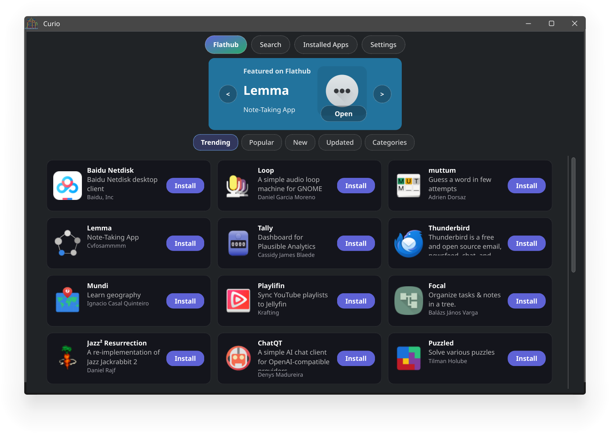
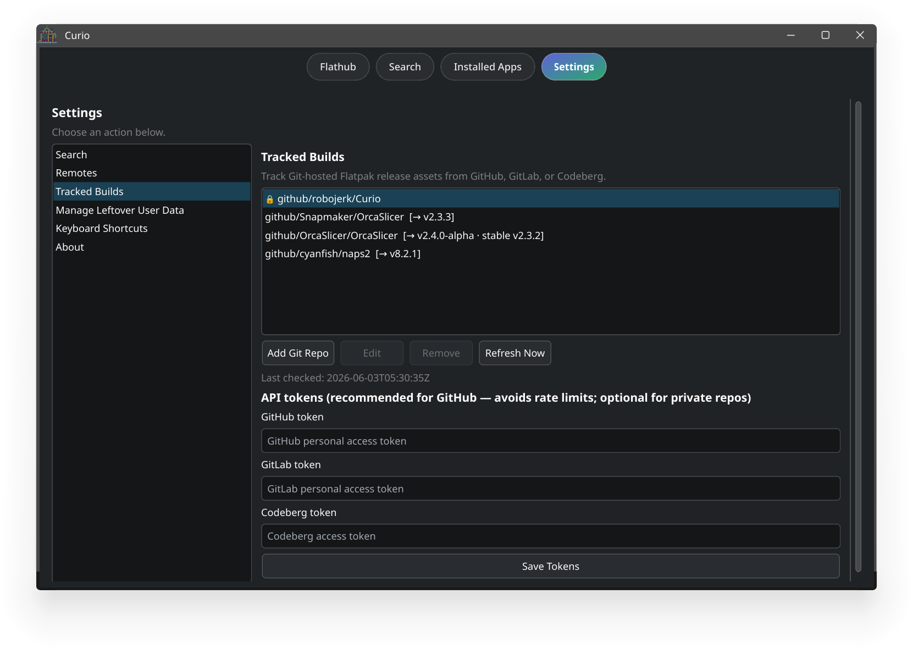

# Curio

A GUI Flatpak store implemented in C++ and Qt 6.

This project is inspired by Bazaar, but it is a separate Qt application. It also includes the ability to track flatpak packages on sites like github and update.

It's an experiment.

**[Download v0.1.2](https://github.com/robojerk/Curio/releases/tag/v0.1.2)** — pre-built Flatpak bundle (x86_64).

```bash
flatpak install -u io.github.curio.Curio-x86_64.flatpak
```

## What it does

Curio talks to Flatpak through **libflatpak** (not the `flatpak` CLI). Browse Flathub, search remotes, install and uninstall apps, and see what you already have installed.

**Tracked builds** watch Git repos (GitHub, GitLab, Codeberg) for release assets — useful when an app ships a `.flatpak` on GitHub but not on Flathub. You can link a repo, pick filters, and install or update from releases. API tokens in Settings help with GitHub rate limits and private repos.

Pre-built Flatpak bundles for Curio itself are attached to [GitHub Releases](https://github.com/robojerk/Curio/releases) when published. Install with:

```bash
flatpak install --user --bundle io.github.curio.Curio-x86_64.flatpak
```

## Screenshots





## Build

You need a C++17 compiler, CMake 3.16+, Qt 6 (Widgets, Network, Concurrent), and libflatpak (`flatpak` / `libflatpak-dev`). AppStream Qt is optional — without it you still get names and icons from Flatpak, just less metadata.

```bash
cmake -S . -B build -DCURIO_SANDBOXED_LIBFLATPAK=OFF
cmake --build build
./build/curio
```
